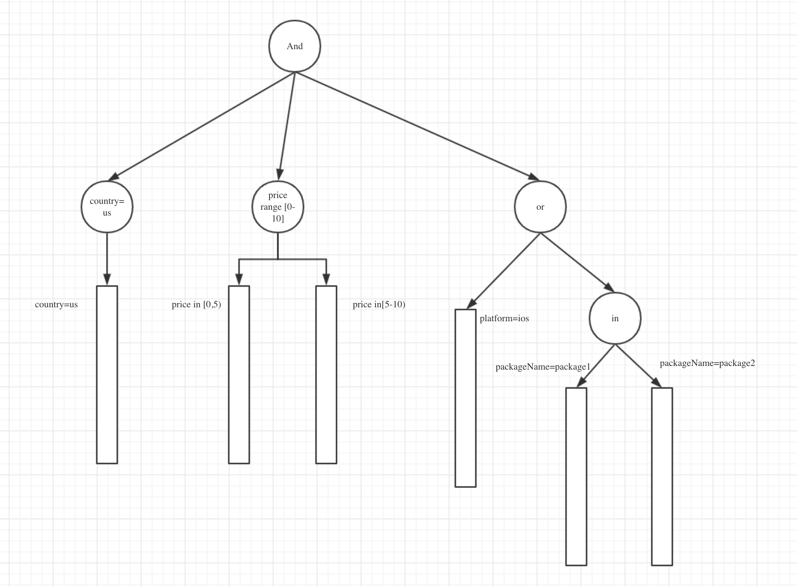

# Juno(朱诺)
朱诺号木星探测器是目前人类是制造出最快的宇宙飞行器。
这里，朱诺是一个通用的易用的高性能的内存型广告检索引擎

## 目标

1. 通用性： 能试用广告检索的大部分情况
2. 易用性： 可以极低的代价从0搭建搜索引擎
3. 高性能： 本身搜索性能20ms内，单机QPS>1-2K
4. 插件化，可扩展： 检索各模块都是接口的形式，可以根据需求轻松定制

## 主要特性

1. 支持倒排索引
   1. 数值型（int, double）
   2. 字符串型
2. 正排索引
   1. 数值型（int, double）
   2. 字符串型
   3. set集合
   4. List
   5. KV
3. 查询支持多索引查询、布尔查询、范围查询、集合查询

## 示例

```go
// 建立索引
ib := NewIndexBuilder(cfg)
ii := ib.build()

// 正排
if1 := ii.GetStorageIndex().Iterator("AdvertiserId").(*datastruct.SkipListIterator)
if2 := ii.GetStorageIndex().Iterator("Platform").(*datastruct.SkipListIterator)
if3 := ii.GetStorageIndex().Iterator("Price").(*datastruct.SkipListIterator)

if331 := ii.GetStorageIndex().Iterator("Price").(*datastruct.SkipListIterator)
if332 := ii.GetStorageIndex().Iterator("Price").(*datastruct.SkipListIterator)
if333 := ii.GetStorageIndex().Iterator("Price").(*datastruct.SkipListIterator)
if334 := ii.GetStorageIndex().Iterator("Price").(*datastruct.SkipListIterator)

// 查询
q := query.NewOrQuery([]query.Query{
			query.NewTermQuery(if3),
			query.NewAndQuery([]query.Query{
				query.NewTermQuery(if1),
				query.NewTermQuery(if2),
				query.NewTermQuery(if3),
			}, nil),
		},
			[]check.Checker{
				check.NewCheckerImpl(if331, 20.0, operation.LT),
				check.NewCheckerImpl(if332, 16.4, operation.LE),
				check.NewCheckerImpl(if333, 0.5, operation.EQ),
				check.NewCheckerImpl(if334, 1.24, operation.EQ),
			},
		)
searchResult := index.Search(query)
fmt.Println(searchResult)
```


## 设计

搜索引擎主要分为2个部分

1. 查询
2. 索引

### 一、查询

#### 查询语法

查询是类sql语法，有表达式组成（可嵌套），表达式有 and, or, not等操作

支持 =, >=, >, <=,<, !=, range, in

查询语法支持三种格式  string,  json, go stuct

```shell
and : &  or : |  in : @  not : #
country=us & (price # [1.0, 2.0, 3.04]) and (platform=ios or package @ ["pacakge1", "pacakge1"] )
```

```json
{
    "and": [
        {
            "=": {
                "field": "country",
                "value": "US"
            }
        },
        {
            "range": {
                "field": "price",
                "value": [
                    1,
                    20
                ]
            }
        },
        {
            "or": [
                {
                    "=": {
                        "field": "platform",
                        "value": "ios"
                    }
                },
                {
                    "in": {
                        "field": "packageName",
                        "value": [
                            "package1",
                            "package2"
                        ]
                    }
                }
            ]
        }
    ]
}
```

```go
// 构建查询
q := query.NewOrQuery([]query.Query{
    query.NewTermQuery(invertIdx.Iterator("A_1").(*datastruct.SkipListIterator)),
    query.NewTermQuery(invertIdx.Iterator("B_2").(*datastruct.SkipListIterator)),
    query.NewAndQuery([]query.Query{
        query.NewTermQuery(tIndex.GetStorageIndex().Iterator("C").(*datastruct.SkipListIterator)),
        query.NewTermQuery(tIndex.GetStorageIndex().Iterator("C").(*datastruct.SkipListIterator)),
    },
        []check.Checker{
            check.NewCheckerImpl(storageIdx.Iterator("C").(*datastruct.SkipListIterator), 20.0, operation.LT),
            check.NewCheckerImpl(storageIdx.Iterator("C").(*datastruct.SkipListIterator), 16.4, operation.GE),
        }),
    query.NewTermQuery(invertIdx.Iterator("A_3").(*datastruct.SkipListIterator)),
}, nil)

// 遍历结果
for q.HasNext() {
  docid := q.Next()
}
```

#### 查询执行过程

1. 构建查询语法树

   

2. 执行语法树

   1. 语法树本身可以抽象成一个迭代器，迭代的过程就是对倒排链查找的过程

3. 过滤

### 二、索引

#### 索引接口

index接口：

```go
type Index interface {
	Add(docInfo *document.DocInfo) error  // 新增文档
	Del(docInfo *document.DocInfo) error  // 删除文档
	GetDataType(fieldName string) document.FieldType  // 获取field类型
	Dump(filename string) error  // 将索引Dump到磁盘
	Load(filename string) error  // 从磁盘加载索引
	Search(query *query.Query)  // 查询接口
}
```

DocInfo:  json结构

```json
{
    "Id": 12345,
    "Fields": [
        {
           "FieldName": "Field1",
           "value":"value",
           "indexType":0
        },
        {
           "FieldName": "Field2",
           "value":"value",
           "indexType":1
        },
        {
           "FieldName": "Field3",
           "value":"value",
           "indexType":2
        }
    ]
}
```

#### 索引内存结构

##### 倒排

倒排索引是一个Key, InvertList结构

- Key： FieldName + Value（一个字符串、一个数值、也可以是一个数值范围）
- InvertList： 是一个有序的集合的接口，，可以是数组、跳表、排序树等
- Value:  一个字符串、一个数值、也可以是一个数值范围

###### 倒排接口：

倒排索引可以有不同的实现方式，只要满足下面的接口，都可以称之为倒排索引

```go
// InvertList 倒排结构的接口，仅负责查询，不负责索引更新
type InvertIndex interface {
	Add(fieldName string, id document.DocId) error
	Del(fieldName string, id document.DocId) bool
	Iterator(fieldName string) datastruct.Iterator
}
```

##### 正排索引

正排分字段存储，结构为map<fieldname, <docid, value>>

###### 正排接口

```go
// 按字段存储正排信息
	Get(filedName string, id document.DocId) interface{}
	Add(fieldName string, id document.DocId, value interface{}) error
	Del(fieldName string, id document.DocId) bool
	Iterator(fieldName string) datastruct.Iterator
```


#### 索引构建

索引构建模块能方便的将数据源中的数据构建成索引，同时能感知数据源的变化，并将变化同步至索引中

示例：

```go
// build index
b, e := builder.NewMongoIndexBuilder(&builder.MongoIndexManagerOps{
    URI:            "mongodb://127.0.0.1:27017",
    IncInterval:    5,
    BaseInterval:   120,
    IncParser:      &CampaignParser{},
    BaseParser:     &CampaignParser{},
    BaseQuery:      bson.M{"status": 1},
    IncQuery:       bson.M{"updated": bson.M{"$gt": time.Now().Unix() - int64(5*time.Second)}},
    DB:             "new_adn",
    Collection:     "campaign",
    ConnectTimeout: 10000,
    ReadTimeout:    20000,
})
if e != nil {
    fmt.Println(e)
    return
}
if e := b.Build(ctx); e != nil {
    fmt.Println("build error", e.Error())
}
tIndex := b.GetIndex()
// invert list
invertIdx := tIndex.GetInvertedIndex()

// storage
storageIdx := tIndex.GetStorageIndex()

// A=1 or B=2 or (c>=16.4 and c <20.0) or A=3
// query
q := query.NewOrQuery([]query.Query{
    query.NewTermQuery(invertIdx.Iterator("A_1").(*datastruct.SkipListIterator)),
    query.NewTermQuery(invertIdx.Iterator("B_2").(*datastruct.SkipListIterator)),
    query.NewAndQuery([]query.Query{
        query.NewTermQuery(tIndex.GetStorageIndex().Iterator("C").(*datastruct.SkipListIterator)),
        query.NewTermQuery(tIndex.GetStorageIndex().Iterator("C").(*datastruct.SkipListIterator)),
    },
        []check.Checker{
            check.NewCheckerImpl(storageIdx.Iterator("C").(*datastruct.SkipListIterator), 20.0, operation.LT),
            check.NewCheckerImpl(storageIdx.Iterator("C").(*datastruct.SkipListIterator), 16.4, operation.GE),
        }),
    query.NewTermQuery(invertIdx.Iterator("A_3").(*datastruct.SkipListIterator)),
}, nil)

// search
res := search.Search(tIndex, q)
```

索引构建模块会支持多种数据源，如文件、mongo、mysql等

